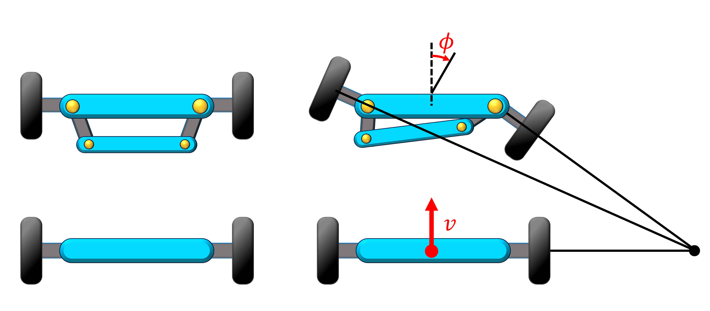

# Creating vehicle interface for Ackermann kinematic model

This page introduces a module vehicle_interface and explains how to implement it.

## What is a vehicle interface

`vehicle interface` is an interface that connects the control commands and your hardware.  
Autoware publishes control commands such as:

- Velocity control
- Steering control
- Car light commands

Then, `vehicle interface` converts these commands into actuation such like:

- Motors and breaks
- The steering wheel
- Lighting control

So think of the vehicle interface as a module that runs the hardware to realize the input commands provided by Autoware.

<figure markdown>
  { align=center }
  <figcaption>
    An example of inputs and outputs for vehicle interface
  </figcaption>
</figure>

This page shows you a brief explanation how to implement your vehicle interface, but [you can see further information of vehicle interface in the "design" page](https://autowarefoundation.github.io/autoware-documentation/main/design/autoware-interfaces/components/vehicle-interface/). **Note that there is no package named "vehicle interface" prepared in Autoware. It is a necessary package to actuate your vehicle, but you have to create one by yourself since it is very specific to your hardware.** For example, if you are using a by-wire kit [PACMod](https://autonomoustuff.com/platform/pacmod), a vehicle interface named [`pacmod_interface` published by TIER IV, Inc.](https://github.com/tier4/pacmod_interface/tree/main) is available. However, if you have constructed something original and haven't found an open source vehicle interface applicable, you have to implement your own vehicle interface from scratch.

---

## How to implement a vehicle interface

The following instructions describe how to create a vehicle interface.

<!-- pmarkdownlint-disable MD029 -->
<!-- Since MD029 cannot recognize nested lists when the indents are defined as two spaces in mdx_truly_sane_lists -->

### 1. Create a directory for vehicle interface

It is recommended to create your vehicle interface at `<your-autoware-dir>/src/vehicle/external`

```bash
cd <your-autoware-dir>/src/vehicle/external
```

### 2. Install or implement your own vehicle interface

If there is an already complete vehicle interface package (like [`pacmod_interface`](https://github.com/tier4/pacmod_interface/tree/main)), you can install it to your environment. If not, you have to implement your own vehicle interface by yourself. Create a new package by `ros2 pkg create`. The following example is creating a vehicle interface package named `my_vehicle_interface`. Write your implementation of vehicle interface in `my_vehicle_interface/src`.

```bash
ros2 pkg create --build-type ament_cmake my_vehicle_interface
```

### 3. Prepare a launch file

After you implement your vehicle interface or you want to debug it by launching it, create a launch file of your vehicle interface, and include it to `vehicle_interface.launch.xml`.

Do not get confused. First, you need to create a launch file for your own vehicle interface module (like `my_vehicle_interface.launch.xml`) **and then include that to `vehicle_interface.launch.xml` which exists in another directory.** Here are the details.

1. Add a `launch` directory in the `my_vehicle_interface` directory, and create a launch file of your own vehicle interface in it. Take a look at [Creating a launch file](https://docs.ros.org/en/humble/Tutorials/Intermediate/Launch/Launch-Main.html) in the ROS 2 documentation.

2. Next, go to `<your-autoware-dir>/src/vehicle`, copy the directory `/sample_vehicle_launch/`, and paste it to the same place (which means it should be lined up with `external` and `sample_vehicle_launch`).

3. You have to rename each "sample_vehicle" to something else. For example, if you want to rename "sample_vehicle" to "my_vehicle_name", you need to change the following. Note that it is restricted to keep the "\_launch" and "\_description" part.

   - Rename the directories
     - `sample_vehicle_launch` &rarr; `my_vehicle_name_launch`
     - `my_vehicle_name_launch/sample_vehicle_launch` &rarr; `my_vehicle_name_launch/my_vehicle_name_launch`
     - `my_vehicle_name_launch/sample_vehicle_description` &rarr; `my_vehicle_name_launch/my_vehicle_name_description`
   - After you rename your directories, rename each "sample_vehicle" to "my_vehicle_name" in the source code.
     - `my_vehicle_name_description/CMakeLists.txt`
     - `my_vehicle_name_description/package.xml`
     - `my_vehicle_name_description/urdf/vehicle.xacro` (there are two parts)
     - `my_vehicle_name_launch/CMakeLists.txt`
     - `my_vehicle_name_launch/package.xml`
     - `README.md` (not necessary)

4. Include your launch file to `my_vehicle_name_launch/my_vehicle_name_launch/launch/vehicle_interface.launch.xml` by opening it and add the include terms like below.

```xml title="vehicle_interface.launch.xml"
<?xml version="1.0" encoding="UTF-8"?>
<launch>
    <arg name="vehicle_id" default="$(env VEHICLE_ID default)"/>

    <include file="$(find-pkg-share my_vehicle_interface)/launch/my_vehicle_interface.launch.xml">
    </include>
</launch>
```

### 4. Build the vehicle interface package and the launch package

Build three packages `my_vehicle_interface`, `my_vehicle_name_launch` and `my_vehicle_name_description` by `colcon build`, or you can just build the entire Autoware if you have done other things.

```bash
colcon build --symlink-install --cmake-args -DCMAKE_BUILD_TYPE=Release --packages-select my_vehicle_interface my_vehicle_name_launch my_vehicle_name_description
```

### 5. When you launch Autoware

Finally, you are done implementing your vehicle interface module! Be careful that you need to launch Autoware with the proper `vehicle_model` option like the example below. This example is launching planning simulator.

```bash
ros2 launch autoware_launch planning.launch.xml map_path:=$HOME/autoware_map/sample-map-planning vehicle_model:=my_vehicle_name sensor_model:=sample_sensor_kit
```

### Tips

There are some tips that may help you.

- You can subdivide your vehicle interface into smaller packages if you want. Then your directory structure may look like below (not the only way though). Do not forget to launch all packages in `my_vehicle_interface.launch.xml`.

  ```bash
  /<your-autoware-dir>/
    /src/
      /vehicle/
        /external/
          /my_vehicle_interface/
            /launch/
              my_vehicle_interface.launch.xml
            /src/
              /package1/
                ...
              /package2/
                ...
              /package3/
                ...
            CMakeLists.txt
            README.md
            package.xml
  ```

- If you are using a vehicle interface and launch package from a open git repository, or created your own as a git repository, it is highly recommended to add those repositories to your `autoware.repos` file which is located to directly under your autoware folder like the example below. You can specify the branch or commit hash by the version tag.

  ```yaml title="autoware.repos"
  # vehicle (this section should be somewhere in autoware.repos and add the below)
  vehicle/my_vehicle_name_launch:
    type: git
    url: https://github.com/<repository-name-A>/my_vehicle_name_launch.git
    version: main
  vehicle/external/my_vehicle_interface:
    type: git
    url: https://github.com/<repository-name-B>/my_vehicle_interface.git
    version: main
  ```

  Then you can import your entire environment easily to another local device by using the `vcs import` command. (See [the source installation guide](https://autowarefoundation.github.io/autoware-documentation/main/installation/autoware/source-installation/#how-to-set-up-a-workspace))

---

## Ackermann kinematic model

Autoware now supports control inputs for vehicles based on an Ackermann kinematic model. This section introduces you a brief concept of Ackermann kinematic model and explains how Autoware controls it.

- If your vehicle does not suit the Ackermann kinematic model, you have to modified the control commands. [Another document gives you an example how to convert your Ackermann kinematic model control inputs into a differential drive model.](https://autowarefoundation.github.io/autoware-documentation/main/how-to-guides/integrating-autoware/creating-vehicle-interface-package/customizing-for-differential-drive-model/)

### Geometry

The basic style of Ackermann kinematic model has four wheels with an Ackermann link on the front, and it is powered by the rear wheels. The key point of Ackermann kinematic model is that the axes of all wheels intersect at a same point, which means all wheels will trace a circular trajectory with a different radii but a common center point. Therefore, this model has a great advantage that it minimizes the slippage of the wheels, and prevent tires to get worn soon.

In general, Ackermann kinematic model accepts the longitudinal speed $v$ and the steering angle $\phi$ as inputs. In autoware, $\phi$ is positive if it is steered counter clockwise, so the steering angle in the figure below is actually negative.

<figure markdown>
  { align=center }
  <figcaption>
    The basic style of an Ackermann kinematic model. The left figure shows a vehicle facing straight forward, while the right figure shows a vehicle steering to the right.
  </figcaption>
</figure>

### Control

Autoware publishes a ROS 2 topic named `control_cmd` from several types of publishers.
A `control_cmd` topic is a [`AckermannControlCommand`](https://gitlab.com/autowarefoundation/autoware.auto/autoware_auto_msgs/-/blob/master/autoware_auto_control_msgs/msg/AckermannControlCommand.idl) type message that contains

```bash title="AckermannControlCommand"
  builtin_interfaces/Time stamp
  autoware_auto_control_msgs/AckermannLateralCommand lateral
  autoware_auto_control_msgs/LongitudinalCommand longitudinal
```

where,

```bash title="AckermannLateralCommand"
  builtin_interfaces/Time stamp
  float32 steering_tire_angle
  float32 steering_tire_rotation_rate
```

```bash title="LongitudinalCommand"
  builtin_interfaces/Time stamp
  float32 speed
  float32 accelaration
  float32 jerk
```

See the [AckermannLateralCommand.idl](https://gitlab.com/autowarefoundation/autoware.auto/autoware_auto_msgs/-/blob/master/autoware_auto_control_msgs/msg/AckermannLateralCommand.idl) and [LongitudinalCommand.idl](https://gitlab.com/autowarefoundation/autoware.auto/autoware_auto_msgs/-/blob/master/autoware_auto_control_msgs/msg/LongitudinalCommand.idl) for details.  
The vehicle interface should realize these control commands by hardware actuation. Moreover, Autoware also provides break commands, light commands, and more (see [vehicle interface design](https://autowarefoundation.github.io/autoware-documentation/main/design/autoware-interfaces/components/vehicle-interface/)), so the vehicle interface should be applicable as long as there is hardware available to handle them.
